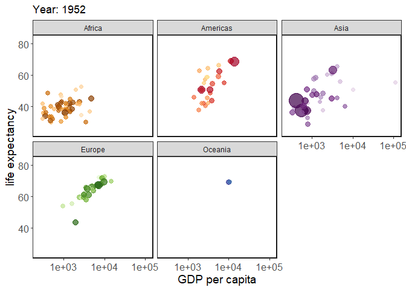

EVRN 745 Assignment 3: gganimate guide
================
Christopher Wheeler
2022-10-04

## 1) Goals of the package

The main goal of gganimate is to extend to ggplot syntax and aesthetic
scheme to the generation of animated graphs. It does this by adding a
few new types of functions dealing with implemeting different types of
animations and rendering the resultant `gganim` objects as GIF files.
These functions are appended to the ggplot call using the expected `+`
operator. Here are some examples of these functions and their uses:

`transition_*()` defines how the data should be spread out and how it
relates to itself across time. `view_*() defines`how the positional
scales should change along the animation. `shadow_*() defines` how data
from other points in time should be presented in the given point in
time. `enter_*()/exit_*()` defines how new data should appear and how
old data should disappear during the course of the animation.
`ease_aes()`defines how different aesthetics should be eased during
transitions.

## 2) Examples demonstrating the functionality of the package

For this first example, we need to load the `gganimte` package, as well
as an ancillary package called `gifski`(this package allows gganimate to
render gif files. I beleive there are other packages you can use that
more or less do the same thing). The first example and figure below make
use of the `mtcars` data set:

``` r
head(mtcars)
```

    ##                    mpg cyl disp  hp drat    wt  qsec vs am gear carb
    ## Mazda RX4         21.0   6  160 110 3.90 2.620 16.46  0  1    4    4
    ## Mazda RX4 Wag     21.0   6  160 110 3.90 2.875 17.02  0  1    4    4
    ## Datsun 710        22.8   4  108  93 3.85 2.320 18.61  1  1    4    1
    ## Hornet 4 Drive    21.4   6  258 110 3.08 3.215 19.44  1  0    3    1
    ## Hornet Sportabout 18.7   8  360 175 3.15 3.440 17.02  0  0    3    2
    ## Valiant           18.1   6  225 105 2.76 3.460 20.22  1  0    3    1

As you can see above, this data set list attributes of a number of car
models. In this graph below, we are taking a base static boxplot showing
the mpg distributions for groups of cars with different numbers of
cylinders, but then using the number of forward gears (as a factor) to
animate.

``` r
library(tidyverse)
library(gganimate)
library(gifski)

# Here is regular ggplot syntax
ggplot(mtcars, aes(factor(cyl), mpg)) + 
  geom_boxplot() + 
  # Here is where we start adding gganimate code
  # The transition_states function allows you to choose the variable (states = x) you want to animate with
  transition_states(
  # The states input is an unquoted column name
    states = gear,
  # The transition_length input is the relative length of time the image transitions
    transition_length = 2,
  # The state_length input is the relative length of time the image stays in each discrete state
    state_length = 1) +
  # the enter and exit functions define how new data should appear and how old data should disappear 
  enter_fade() + 
  exit_shrink() +
  # ease_aes() defines the rate of change during transitions between states
  ease_aes('sine-in-out') + 
  # this is all theme stuff
   theme_bw() + 
  theme(panel.grid.major = element_blank(), 
        panel.grid.minor = element_blank(),
        panel.background = element_rect(colour = "black", size = 1)) + 
  theme(axis.text = element_text(size = 12),
        axis.title = element_text(size = 14))
```

<!-- -->

## 3) An example figure

This next example uses the gapminder data set, which lists demographic
statistics for multiple countries and how they change yearly throughout
the 20th century. This graph uses time as its transition variable, and
plots life expectancy versus GDP grouped by continent. Additionally,
population for each country is mapped to the size of the point on the
plot (i.e., the dot getting larger through time indicates increasing
population).

``` r
library(gapminder)
head(gapminder)
```

    ## # A tibble: 6 x 6
    ##   country     continent  year lifeExp      pop gdpPercap
    ##   <fct>       <fct>     <int>   <dbl>    <int>     <dbl>
    ## 1 Afghanistan Asia       1952    28.8  8425333      779.
    ## 2 Afghanistan Asia       1957    30.3  9240934      821.
    ## 3 Afghanistan Asia       1962    32.0 10267083      853.
    ## 4 Afghanistan Asia       1967    34.0 11537966      836.
    ## 5 Afghanistan Asia       1972    36.1 13079460      740.
    ## 6 Afghanistan Asia       1977    38.4 14880372      786.

``` r
# Here is regular ggplot syntax
ggplot(gapminder, aes(gdpPercap, lifeExp, size = pop, colour = country)) +
  geom_point(alpha = 0.7, show.legend = FALSE) +
  scale_colour_manual(values = country_colors) +
  scale_size(range = c(2, 12)) +
  scale_x_log10() +
  facet_wrap(~continent) +
  # Here is the gganmimate code
  # the labs function creates a label of the transition states as it changes, as well as the x and y axes
  labs(title = 'Year: {frame_time}', x = 'GDP per capita', y = 'life expectancy') +
  # the transition_time function accepts the an unquoted column name as the time series transition state
  # it is the time series version of the transition_states function above
  transition_time(year) +
  # ease_aes() defines the rate of change during transitions between states, as above
  ease_aes('linear') + 
  # this is all theme stuff
  theme_bw() + 
  theme(panel.grid.major = element_blank(), 
        panel.grid.minor = element_blank(),
        panel.background = element_rect(colour = "black", size = 1)) + 
  theme(axis.text = element_text(size = 12),
        axis.title = element_text(size = 14))
```

<!-- -->
