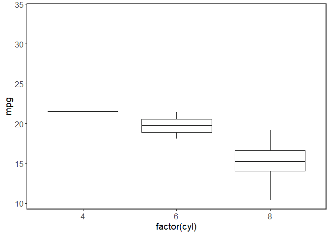

EVRN 745 Assignment 3: gganimate guide
================
Christopher Wheeler
2022-10-04

## 1) Goals of the package

The main goal of gganimate is to extend to ggplot syntax and aesthetic
scheme to the generation of animated graphs. It does this by adding a
few new types of functions dealing with implemeting different types of
animations and rendering the resultant `gganim` objects as GIF files.
These functions are appended to the ggplot call using the expected `+`
operator. Here are some examples of these functions and their uses:

`transition_*()` defines how the data should be spread out and how it
relates to itself across time. `view_*() defines`how the positional
scales should change along the animation. `shadow_*() defines` how data
from other points in time should be presented in the given point in
time. `enter_*()/exit_*()` defines how new data should appear and how
old data should disappear during the course of the animation.
`ease_aes()`defines how different aesthetics should be eased during
transitions.

## 2) Examples demonstrating the functionality of the package

``` r
library(tidyverse)
```

    ## Warning: package 'tidyverse' was built under R version 4.1.3

    ## -- Attaching packages --------------------------------------- tidyverse 1.3.1 --

    ## v ggplot2 3.3.5      v purrr   0.3.4 
    ## v tibble  3.1.8      v dplyr   1.0.10
    ## v tidyr   1.2.0      v stringr 1.4.0 
    ## v readr   1.4.0      v forcats 0.5.1

    ## Warning: package 'tibble' was built under R version 4.1.3

    ## Warning: package 'tidyr' was built under R version 4.1.3

    ## Warning: package 'dplyr' was built under R version 4.1.3

    ## -- Conflicts ------------------------------------------ tidyverse_conflicts() --
    ## x dplyr::filter() masks stats::filter()
    ## x dplyr::lag()    masks stats::lag()

``` r
library(gganimate)
```

    ## Warning: package 'gganimate' was built under R version 4.1.3

``` r
library(gifski)
```

    ## Warning: package 'gifski' was built under R version 4.1.3

``` r
ggplot(mtcars, aes(factor(cyl), mpg)) + 
  geom_boxplot() + 
  # Here comes the gganimate code
  transition_states(
    gear,
    transition_length = 2,
    state_length = 1) +
  enter_fade() + 
  exit_shrink() +
  ease_aes('sine-in-out') + 
   theme_bw() + 
  theme(panel.grid.major = element_blank(), 
        panel.grid.minor = element_blank(),
        panel.background = element_rect(colour = "black", size = 1)) + 
  theme(axis.text = element_text(size = 12),
        axis.title = element_text(size = 14))
```

<!-- -->

## 3) An example figure

``` r
library(gapminder)
```

    ## Warning: package 'gapminder' was built under R version 4.1.3

``` r
ggplot(gapminder, aes(gdpPercap, lifeExp, size = pop, colour = country)) +
  geom_point(alpha = 0.7, show.legend = FALSE) +
  scale_colour_manual(values = country_colors) +
  scale_size(range = c(2, 12)) +
  scale_x_log10() +
  facet_wrap(~continent) +
  # Here comes the gganimate specific bits
  labs(title = 'Year: {frame_time}', x = 'GDP per capita', y = 'life expectancy') +
  transition_time(year) +
  ease_aes('linear') + 
  theme_bw() + 
  theme(panel.grid.major = element_blank(), 
        panel.grid.minor = element_blank(),
        panel.background = element_rect(colour = "black", size = 1)) + 
  theme(axis.text = element_text(size = 12),
        axis.title = element_text(size = 14))
```

<!-- -->
